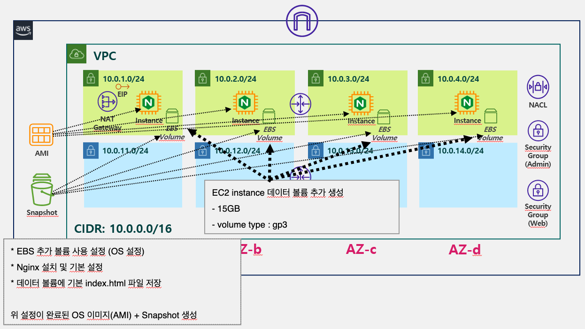

# Info
Terraform VPC + EC2 with EBS instance Example



#### VPC
* VPC CIDR 은 10.0.0.0/16 
* Subnet CIDR 은 10.X.0.0/24 
* Subnet 은 본인이 선택한 Region 의 Availability Zone 수 만큼 생성 (ex. us-east-1 -> 4 Availability Zones -> 4 Subnets)
* 각 Availability Zone 별로 Public Subnet, Private Subnet 페어로 한개씩 존재하도록 생성
* Internet Gateway 생성 후 VPC 에 Attach
* Route Table 은 Public 과 Private Route Table 한개씩 총 2개 생성
* Public Route Table 은 Internet Gateway 로 통신 가능하도록 Route 추가 후 Public Subnet 4개와 연결 (Associatation)
* Private Route Table 은 Route 추가 없이 Private Subnet 4개와 연결 (Associatation)
* NAT Gateway 용 EIP 생성
* Public Subnet 에 NAT Gateway 생성
* Private Route Table 에 외부 통신을 위해서 NAT Gateway 로 통신 가능하도록 Route 추가
* SSH 허용을 위한 Admin 용 Security Group 과 HTTP 웹 접속 허용을 위한 Web Security Group, 총 두개 Security Group 생성
* Admin Security Group 에는 SSH(20) 포트를 본인 Cloud9 Public IP 허용하는 Rule 생성
* Web Security Group 에는 HTTP(80) 포트를 모두 허용 하는 Rule 생성
* 각 Resource 를 생성하는 코드를 모두 Module 로 제작
 

#### EC2 with EBS Volume
* Instance 에 Volume 사용 설정 완료된 AMI 이미지 제작
    * 추가 Volume 사용을 위한 파일시스템 포맷 및 마운트
    * Nginx 웹서버 설치 및 설정
    * 추가 Volume 이 마운트된 디렉토리에 HTML index 파일 생성
    * 위 설정이 완료된 Instance 와 EBS 볼륨 모두 스냅샷 + AMI 생성
* 각 Public Subnet 에 미리 제작된 AMI 를 사용하여 EC2 Instance 와 EBS Volume 배포.
* EC2 Instance 마다 EBS 데이터 Volume 생성후 Attach
* 각 EC2 Instance 생성 후, User data 를 통해 index.html 테스트 웹 파일에 추가 정보 append

# Step

## 1. 변수 설정
ebs.tfvars 파일 확인 
실행 환경에 맞게 변경

```
# ebs.tfvars 파일


prefix              =       "user**"
region              =       "ap-northeast-2"
vpc_cidr            =       "10.0.0.0/16"

public_subnets      =       [
    {cidr = "10.0.1.0/24", availability_zone = "ap-northeast-2a"},
    {cidr = "10.0.3.0/24", availability_zone = "ap-northeast-2c"},
    ]

private_subnets = [
    {cidr = "10.0.11.0/24", availability_zone = "ap-northeast-2a"},
    {cidr = "10.0.13.0/24", availability_zone = "ap-northeast-2c"},
]

admin_access_cidrs      =   ["<<YOUR_LOCAL_IP_CIDR>>"]

ami_id                  =   "<<AMI_ID>>"
data_vol_snapshot_id    =   "<<DATA_VOLUME_SNAPSHOT_ID>>"

instance_type           =   "t3.micro"
keypair_name            =   "<<YOUR_KEYPAIR_NAME>>"
data_volume_size        =   "15"


```
* Prefix 는 알맞게 변경
* Region 은 본인이 사용할 region 코드로 변경
* Subnet 의 Availability Zone 값은 Region 에 맞게 변경
* SSH 접속 허용할 IP 값 변경
* EC2 instance 의 AMI 와 추가 데이터 볼륨 생성을 위한 Snapshot ID 설정
* EC2 instance 에 설정할 keypair 명 설정
* 데이터용 EBS 볼륨 사이즈 설정


## 2. init  
Init 명령으로 Terraform 수행을 위한 provider plugin 초기화 및 다운로드 수행

```
terraform init
```

## 3. plan  
Plan 명령으로 Terraform 수행 전 실행 시뮬레이션 확인
```
terraform plan --var-file=ebs.tfvars
```  

## 4. apply  
Apply 명령으로 Terraform 을 통한 Resource 생성 수행
```
terraform apply --var-file=ebs.tfvars
```  

## 5. 실행 내용 확인
* 선택한 Region 에 VPC, Subnet, Internet Gateway, Route Table, NAT Gateway, Security Group, instance 생성 내용 확인.  
* Instance 에 EBS 볼륨 Attach 상태 확인.   
* 생성된 Instance 에 웹서버 설치 확인. Instance 의 Public IP(또는 Public DNS) 로 브라우저에서 테스트 페이지 접속 확인. 


# Resource 삭제

## 1. destroy
Destroy 명령으로 생성된 EC2 Instance, EBS 볼륨 및 VPC 삭제 수행
```
terraform destroy --var-file=ebs.tfvars
```
